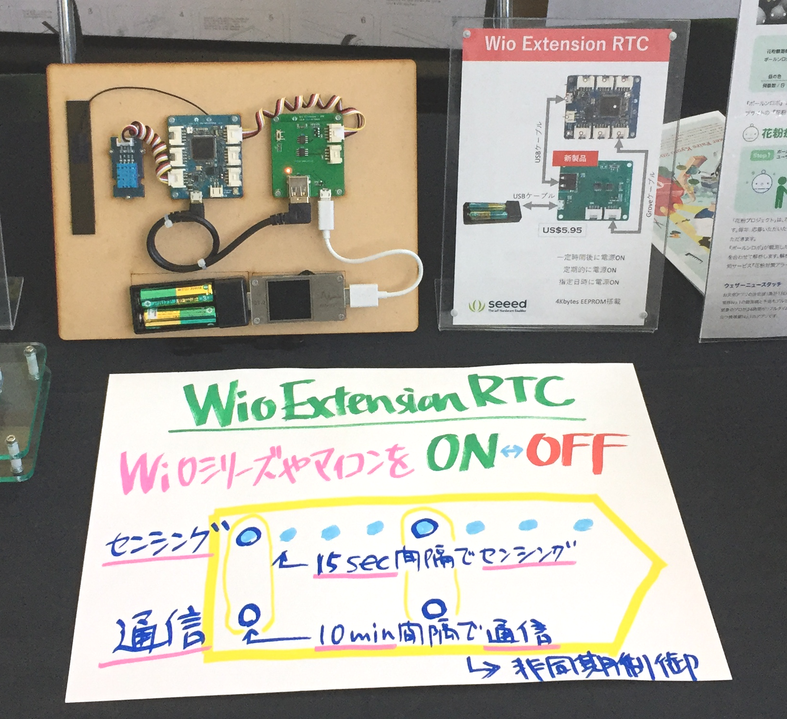

Wio Extension - RTCを使った、サンプルコードです。

## Wio Extension - RTC

* [製品ページ](https://www.seeedstudio.com/Wio-Extension-RTC-p-4002.html)
* [Wiki](http://wiki.seeedstudio.com/Wio-Extension-RTC/)

## [Maker Faire Kyoto 2019](https://makezine.jp/event/mfk2019/) (2019/5/4-5)



* [スケッチ](MFK2019DEMO/MFK2019DEMO.ino)
* [資料](https://www.slideshare.net/TakashiMatsuoka2/wio-ltewio-ext-rtc/15)

### 動作

* 15秒周期に回路の電源が入り、温度、湿度を測る。
* 40回測定（10分）すると、それまでの温度、湿度の平均、最大、最小をSORACOM Unified Endpointへ送る。

### 特徴

* 15秒毎にMCU電源ON、10分毎にLTEモジュール電源ONすることで、電力消費を抑えています。
* 一次的なデータ保存は、Wio Extension - RTCのEEPROMを使っています。
* SORACOMのバイナリパーサーを使うことで、通信量を抑えています。
* SORACOMのUnified Endpointを使うことで、スケッチを変更せずにデータ転送先を変更できます。

### パーツ

* [Wio LTE M1/NB1(BG96)](https://soracom.jp/products/module/wio_lte_m1_nb1/)
* [Wio Extension - RTC (103100082)](https://www.seeedstudio.com/Wio-Extension-RTC-p-4002.html)
* [Grove - Temperature & Humidity Sensor (DHT11) (101020011)](https://www.seeedstudio.com/Grove-Temperature-Humidity-Sensor-DHT11.html)

### バイナリパーサー設定

```
temp-avg::uint:16:little-endian:/100 temp-min::uint:16:little-endian:/100 temp-max::uint:16:little-endian:/100 humi-avg::uint:16:little-endian:/100 humi-min::uint:16:little-endian:/100 humi-max::uint:16:little-endian:/100
```
